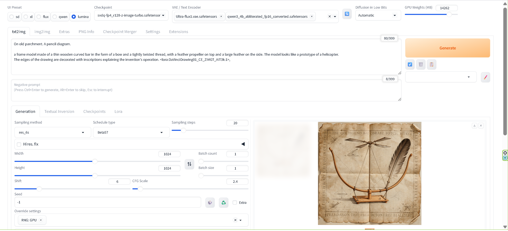

<h1 align="center">Stable Diffusion WebUI Forge - Nunchaku</h1>

⚠️ **This project is in beta testing and is not ready for general users.**

⚠️ **This project requires Python 3.13 exclusively.**

  

## About

This program is a fork that integrates Nunchaku support into Stable Diffusion WebUI Forge.

## Features

### 🎯 Key Features

- **Nunchaku SDXL Support**
  - Full support for Nunchaku SDXL models with LoRA and ControlNet
  - Optimized 4-bit quantized SDXL models with SVDQ W4A4 engine (Rank 128)
  - Automatic model detection and loading
  - LoRA loader support for Nunchaku SDXL models
  - ControlNet support for Nunchaku SDXL models

- **LoRA Support for Nunchaku Qwen Image and Z-Image**
  - ✅ **Full LoRA support for Nunchaku Qwen Image (QI) models**
  - ✅ **Full LoRA support for Nunchaku Z-Image (ZIT) models**
  - Completely separated implementations for Qwen Image and Z-Image
  - Support for standard LoRA formats (lora_A/lora_B, lora_up/lora_down)
  - Comprehensive logging with format detection for all LoRAs
  - Robust change detection to handle model reloads correctly
  - AWQ quantization layer handling with safety switch

- **Union ControlNet for Flux1, Nunchaku Flux1, and Nunchaku Qwen Image**
  - ✅ **Union ControlNet support for Flux1 and Nunchaku Flux1 models**
  - ✅ **Union ControlNet support for Nunchaku Qwen Image (QI) models**
  - Multiple ControlNet models can be used simultaneously (Union ControlNet)
  - Supports Flux Union ControlNet models (e.g., `flux_shakker_labs_union_pro-2-fp8.safetensors`)
  - Supports Qwen Image Union ControlNet models (e.g., `Qwen-Image-InstantX-ControlNet-Union.safetensors`)
  - Automatic model detection and loading:
    - Flux models: via `controlnet_x_embedder.weight` key detection
    - Qwen Image models: via `transformer_blocks.0.img_mlp.net.0.proj.weight` key detection
  - VAE wrapper for seamless Forge VAE integration with ComfyUI ControlNet interface
  - Strict model type checking to ensure compatibility with correct model types
  - Complete and independent implementation for each model type

  

  *Flux1 Union ControlNet workflow example*

- **Built-in ADetailer**
  - Python 3.13 compatible face detection and enhancement
  - YOLOv8, YOLOv11, and InsightFace hybrid detection system
  - Enhanced face detection accuracy with complementary detection
  - Automatic model download and management
  - SDXL/Pony optimized detection thresholds

- **Python 3.13 Exclusive**
  - Latest Python features and performance improvements
  - Optimized for modern hardware and workflows
  - Future-proof architecture

## Models

### Nunchaku SDXL Models

Nunchaku SDXL models are available from the following repository:

- **[Nunchaku-R128-SDXL-Series](https://huggingface.co/ussoewwin/Nunchaku-R128-SDXL-Series)**  
  High-fidelity 4-bit quantized SDXL models optimized using Nunchaku (SVDQ W4A4) engine with Rank 128 (r128) for maximum quality preservation.

**Installation:**
1. Download the `.safetensors` files from the repository
2. Place them in `models/Stable-diffusion/` directory
3. The models will be automatically detected and loaded

## Known Limitations

### LoRA Format Support for Nunchaku Models

**⚠️ Important:** The following limitations apply **only to Nunchaku quantization models** (Nunchaku Qwen Image, Nunchaku Z-Image, Nunchaku SDXL). Standard (non-quantized) models may support additional LoRA formats.

### LoKR (Lycoris) LoRA Support

**Status:** ❌ Not Supported for Nunchaku Models

**Issue:** LoRAs in LoKR format (created by Lycoris) are not supported for Nunchaku quantization models.

**Note:** LoKR format LoRAs may work with standard (non-quantized) Qwen Image, Z-Image, or SDXL models, but this implementation is designed specifically for Nunchaku quantization models.

⚠️ **Development History:** We have spent considerable time analyzing the internal structure of LoKR format and performing extensive mapping tests. Despite these efforts, we have not been able to find a successful way to apply LoKR weights to Nunchaku quantization models. The experimental conversion code has been tested but ultimately disabled due to incompatibility issues.

- LoKR weights are automatically skipped when detected for Nunchaku models (experimental conversion code is disabled).
- Converting to Standard LoRA using SVD approximation (via external tools or scripts) has also been tested and found to result in noise/artifacts when applied to Nunchaku quantization models.

**Conclusion:** At this time, we have not found a way to successfully apply LoKR weights to Nunchaku models. Please use Standard LoRA formats for Nunchaku models.

### Supported LoRA Formats for Nunchaku Models

**✅ Standard LoRA (Rank-Decomposed):**

Supported weight keys:
- `lora_up.weight` / `lora_down.weight`
- `lora.up.weight` / `lora.down.weight`
- `lora_A.weight` / `lora_B.weight`
- `lora.A.weight` / `lora.B.weight`

These are the standard formats produced by Kohya-ss, Diffusers, and most training scripts.

**❌ LoKR (Lycoris):** Not supported for Nunchaku models (Keys like `lokr_w1`, `lokr_w2`)

**❌ LoHa:** Not supported for Nunchaku models (Keys like `hada_w1`, `hada_w2`)

**❌ IA3:** Not supported for Nunchaku models

## Changelog

### Version 1.2.1

- **Added Union ControlNet support for Nunchaku Qwen Image**
  - Full Union ControlNet support for Nunchaku Qwen Image (QI) models
  - Multiple ControlNet models can be used simultaneously (Union ControlNet)
  - Supports Qwen Image Union ControlNet models (e.g., `Qwen-Image-InstantX-ControlNet-Union.safetensors`)
  - Automatic model detection via `transformer_blocks.0.img_mlp.net.0.proj.weight` key
  - Strict model type checking to ensure compatibility only with Nunchaku Qwen Image models
  - VAE wrapper for seamless Forge VAE integration with ComfyUI ControlNet interface
  - Complete and independent implementation separate from Flux ControlNet
  - Fixed device placement issues for ControlNet model loading
  - See [Release Notes](https://github.com/ussoewwin/Stable-Diffusion-WebUI-Forge-Nunchaku/releases/tag/1.2.1) for details

### Version 1.2.0

- **Added LoRA support for Nunchaku Qwen Image and Z-Image models**
  - Full LoRA support for Nunchaku Qwen Image (QI) models
  - Full LoRA support for Nunchaku Z-Image (ZIT) models
  - Completely separated implementations for Qwen Image and Z-Image
  - Comprehensive logging with format detection for all LoRAs
  - Robust change detection to handle model reloads correctly
  - Support for standard LoRA formats (lora_A/lora_B, lora_up/lora_down)
  - AWQ quantization layer handling with safety switch
  - See [Release Notes](https://github.com/ussoewwin/Stable-Diffusion-WebUI-Forge-Nunchaku/releases/tag/1.2.0) for details

### Version 1.1.0

- **Added Union ControlNet support for Flux1 and Nunchaku Flux1**
  - Full Union ControlNet support for both Flux1 and Nunchaku Flux1 models
  - Multiple ControlNet models can be used simultaneously
  - Automatic model detection via `controlnet_x_embedder.weight` key
  - VAE wrapper for seamless Forge VAE integration
  - See [Release Notes](https://github.com/ussoewwin/Stable-Diffusion-WebUI-Forge-Nunchaku/releases/tag/1.1.0) for details

### Version 1.0.7

- **Added ADetailer as built-in extension**
  - Integrated [ADetailer_without_mediapipe](https://github.com/ussoewwin/ADetailer_without_mediapipe) as a standard built-in feature
  - Python 3.13 compatible with InsightFace instead of MediaPipe
  - Includes YOLOv8, YOLOv11, and InsightFace hybrid detection system
  - Fixed ControlNet preprocessor initialization issue
  - Added `extensions-builtin/adetailer/models/` to `.gitignore`

### Version 1.0.6

- Nunchaku SDXL loader, LoRA loader, and ControlNet support completed

## Base Repositories

This project is built upon the following repositories:

- **[stable-diffusion-webui-forge](https://github.com/lllyasviel/stable-diffusion-webui-forge)**  
  Original Forge implementation by [@lllyasviel](https://github.com/lllyasviel)

- **[sd-webui-forge-classic (neo branch)](https://github.com/Haoming02/sd-webui-forge-classic/tree/neo)**  
  Classic Forge implementation by [@Haoming02](https://github.com/Haoming02)

- **[ComfyUI](https://github.com/Comfy-Org/ComfyUI)**  
  The most powerful and modular diffusion model GUI, API and backend with a graph/nodes interface by [@Comfy-Org](https://github.com/Comfy-Org)

- **[ComfyUI-nunchaku-unofficial-loader](https://github.com/ussoewwin/ComfyUI-nunchaku-unofficial-loader)**  
  Nunchaku integration reference implementation by [@ussoewwin](https://github.com/ussoewwin)

- **[ComfyUI-QwenImageLoraLoader](https://github.com/ussoewwin/ComfyUI-QwenImageLoraLoader)**  
  LoRA Loader & Diffsynth ControlNet Loader for Nunchaku Qwen Image & Nunchaku Z-Image Turbo by [@ussoewwin](https://github.com/ussoewwin)

- **[ADetailer_without_mediapipe](https://github.com/ussoewwin/ADetailer_without_mediapipe)**  
  ADetailer with Python 3.13 support using InsightFace instead of MediaPipe by [@ussoewwin](https://github.com/ussoewwin)

## License

This project is licensed under **AGPL-3.0** (GNU Affero General Public License v3.0).

### Licenses of Base Repositories

This project is built upon the following repositories, each with their respective licenses:

- **[stable-diffusion-webui-forge](https://github.com/lllyasviel/stable-diffusion-webui-forge)** - AGPL-3.0
- **[sd-webui-forge-classic (neo branch)](https://github.com/Haoming02/sd-webui-forge-classic/tree/neo)** - AGPL-3.0
- **[ComfyUI](https://github.com/Comfy-Org/ComfyUI)** - GPL-3.0
- **[ComfyUI-nunchaku-unofficial-loader](https://github.com/ussoewwin/ComfyUI-nunchaku-unofficial-loader)** - Apache 2.0
- **[ComfyUI-QwenImageLoraLoader](https://github.com/ussoewwin/ComfyUI-QwenImageLoraLoader)** - Apache 2.0
- **[ADetailer_without_mediapipe](https://github.com/ussoewwin/ADetailer_without_mediapipe)** - GPL-3.0

See [LICENSE](LICENSE) file for details.